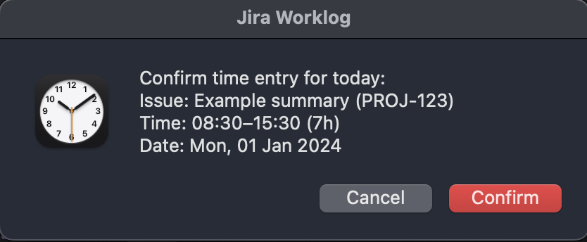

# Jira Time Shooter

- Automate your Jira worklog entries — no more manual input.
- Runs in the background via cron and shows a confirmation popup at your chosen time each weekday.
- Just **Confirm** or **Cancel**; no need to open Jira or enter time yourself.
- Designed for macOS users who want a "set and forget" solution for effortless Jira time tracking.

## Confirmation Popup (macOS)
Each run prompts a macOS confirmation popup before logging time. Click **Confirm** to submit or **Cancel** to skip.



## Requirements
- Python 3.9+ (tested with Python 3.13)

## Installation

1. **Jira API Token**

   Generate a Jira API token from [Atlassian API Tokens](https://id.atlassian.com/manage-profile/security/api-tokens)

2. **Setup**

   ```bash
   python3 -m venv venv
   ./venv/bin/pip install -U pip
   ./venv/bin/pip install -r requirements.txt
   ```

3. **Configure environment variables**

   ```bash
   export JIRA_URL="https://your-jira-instance.atlassian.net"
   export ISSUE_KEY="ISSUE-1234" 
   export JIRA_EMAIL="your-email@example.com"
   export JIRA_API_TOKEN="your-api-token"
   ```

## Cron Setup (Unix)
This sets up an automatic run of the script at a fixed schedule.  
Example: run every weekday (Mon–Fri) at 10:00:
```bash
( crontab -l 2>/dev/null; echo "0 10 * * 1-5 /bin/bash -lc 'cd \"$(pwd)\" && \"$(pwd)/venv/bin/python\" main.py >> \"$(pwd)/cron.log\" 2>&1'" ) | crontab -
```

## Remove Cron Job (Unix)
To remove only the `jira-time-shooter` cron entry (and keep other cron jobs untouched):

```bash
crontab -l | grep -v "jira-time-shooter" | crontab -
```

## Manual Test
```bash
./venv/bin/python main.py
```


## Windows Setup
For Windows users, cron is not available.  
Instead, use **Task Scheduler** to run `python main.py` at the desired time (e.g., weekdays at 10:00).  
- Program/script: path to your `python.exe` inside the virtualenv  
- Arguments: path to `main.py`  
- Start in: project folder
